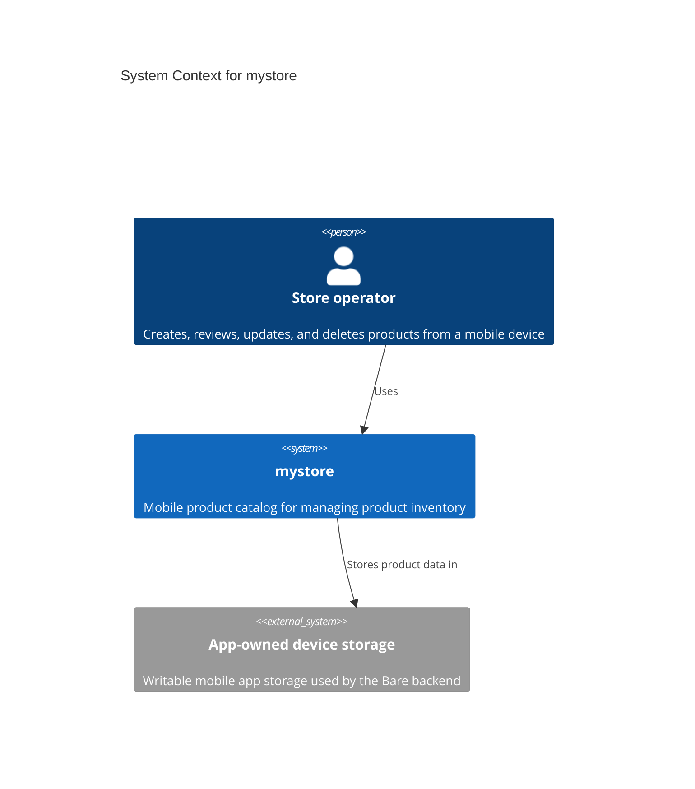
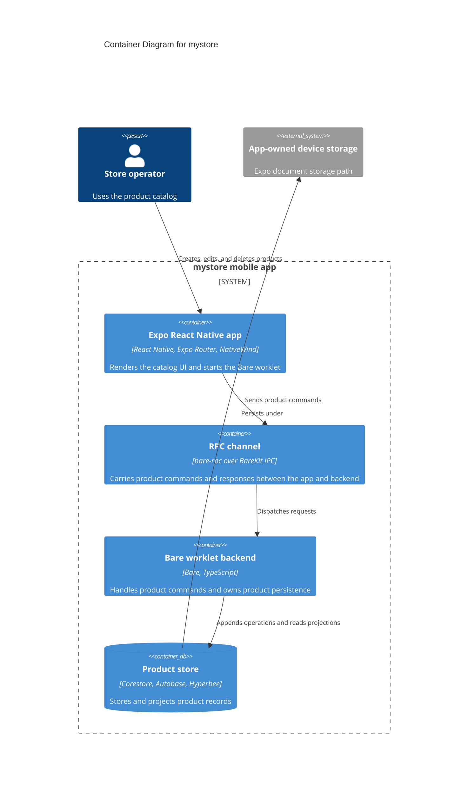
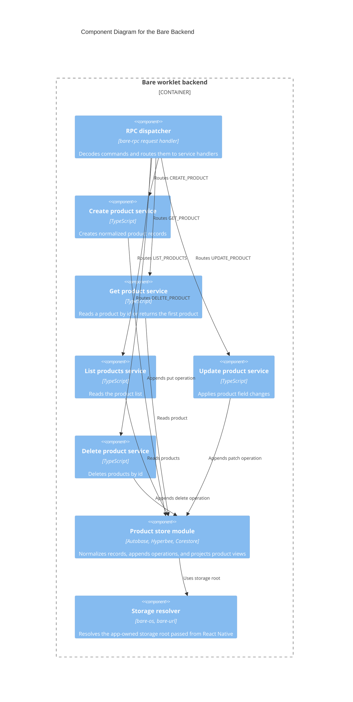
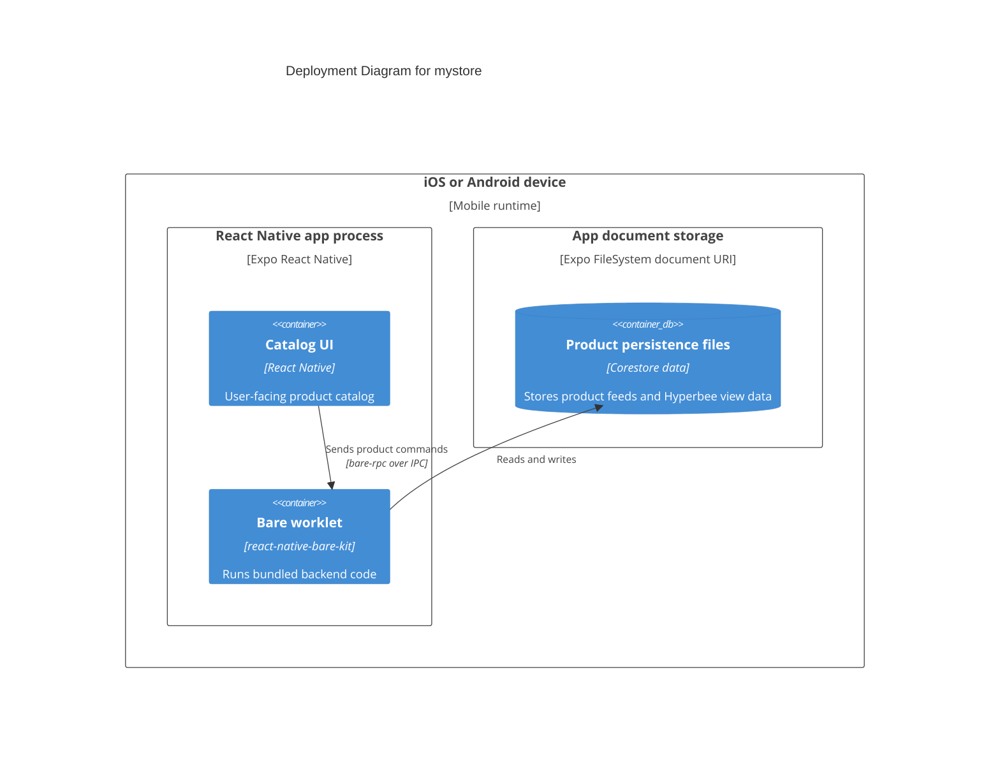

# Architecture

This page describes mystore with C4-style views. The system is small, so the diagrams focus on the runtime boundaries that matter: the mobile user interface, the Bare worklet backend, RPC communication, and local product storage.

## C4 Context

## C4 Container

## C4 Component

## C4 Deployment

## Runtime Flow

The React Native app starts the Bare worklet with the bundled backend and passes the Expo document storage URI as the backend storage root. The app then opens a `bare-rpc` channel over the worklet IPC stream.

Product operations are sent as command codes. The backend decodes the request payload, routes the command to a service handler, and replies with a structured response. Product writes are appended as operations into Autobase, and Hyperbee provides the projected product view used by reads and list operations.
